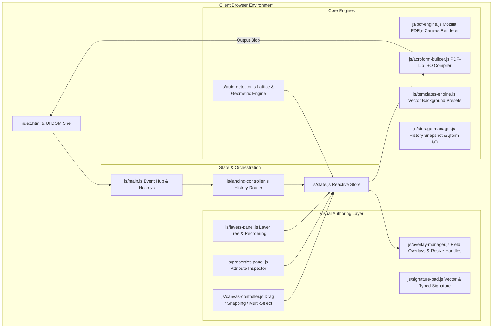

# JustForms Technical Documentation & Architecture Manual

> **Version**: 1.1.0 (RC v1.1)  
> **Repository**: [github.com/sshrestha-design/justforms](https://github.com/sshrestha-design/justforms)  
> **Production URL**: [justforms.vercel.app](https://justforms.vercel.app)  
> **Author & Lead Architect**: Sagar Shrestha  

---

## 📖 Table of Contents

1. [Executive Summary & Core Philosophy](#1-executive-summary--core-philosophy)
2. [System Architecture & Data Flow](#2-system-architecture--data-flow)
3. [Module & Subsystem Reference (`js/`)](#3-module--subsystem-reference-js)
4. [Field Types & Attributes Specification](#4-field-types--attributes-specification)
5. [Project File Schema (`.jform`)](#5-project-file-schema-jform)
6. [ISO 32000 AcroForm Compilation Pipeline](#6-iso-32000-acroform-compilation-pipeline)
7. [Universal Auto-Detection Engine](#7-universal-auto-detection-engine)
8. [Canvas Snapping & Guidelines Mathematics](#8-canvas-snapping--guidelines-mathematics)
9. [Design System & CSS Architecture](#9-design-system--css-architecture)
10. [Development, Testing & Deployment Protocol](#10-development-testing--deployment-protocol)

---

## 1. Executive Summary & Core Philosophy

**JustForms** is a high-performance, client-side web application for designing, editing, and compiling interactive PDF AcroForms. 

### Core Architectural Guarantees

1. **100% In-Browser Execution (Zero Cloud Storage)**:
   - All PDF parsing (via Mozilla PDF.js) and AcroForm compilation (via PDF-Lib) run entirely in the browser memory thread.
   - Documents, field metadata, and signatures are never sent to external servers or cloud databases.
2. **Zero Framework Bloat**:
   - Built on native **ES Modules (ESM)** and modern Web APIs (`requestAnimationFrame`, `ResizeObserver`, `Path2D`, `OffscreenCanvas`).
   - Clean DOM rendering with zero virtual-DOM overhead.
3. **ISO 32000-1 Compliance**:
   - Exported interactive documents are standard AcroForms compatible with Adobe Acrobat Reader, Apple Preview, Google Chrome, Microsoft Edge, Mozilla Firefox, and DocuSign.

---

## 2. System Architecture & Data Flow



---

## 3. Module & Subsystem Reference (`js/`)

### 1. `js/state.js`
The single source of truth for global application state:
- `state.pdfDoc`: Active Mozilla PDF.js proxy document.
- `state.originalPdfBytes`: Raw `Uint8Array` of the uploaded or generated PDF.
- `state.fields`: Array of placed form field objects.
- `state.selectedFieldIds`: Set of currently selected field IDs.
- `state.activeTool`: Active cursor tool (`select`, `textField`, `checkBox`, `radioGroup`, `dropdown`, `dateField`, `signature`, `hand`).
- `state.guidesEnabled`: Boolean toggle for smart alignment guidelines and magnetic snapping (`Cmd+;`).
- `state.zoom`: Viewport scale factor (default: `1.0`).

### 2. `js/main.js`
Central orchestrator initialized on `DOMContentLoaded`:
- Wires top toolbar actions (Tool pickers, Zoom In/Out/Fit, Undo/Redo, Auto-Detect, Test Mode, Export PDF).
- Global keybinding dispatcher (`V`, `T`, `C`, `R`, `D`, `S`, `Cmd+Z`, `Cmd+Y`, `Cmd+;`, `Cmd+A`, `Delete`, `Escape`).
- Synchronizes properties panel, layers panel, and undo toast notifications.

### 3. `js/canvas-controller.js`
Interactive viewport and geometric snapping engine:
- Pointer tracking, multi-element marquee lasso selection, and `Alt + Drag` cloning.
- Smart alignment guidelines: horizontal/vertical bounding alignment, center-canvas guide (`#ec4899`), and real-time gap distribution badges (`.spacing-badge`).
- Right-click canvas context menu (`#canvasContextMenu`) for field actions.
- Interactive Fill & Test mode handling.

### 4. `js/overlay-manager.js`
Renders and updates DOM element overlays on top of the PDF canvas:
- Generates 8-point resize handles (`nw`, `n`, `ne`, `e`, `se`, `s`, `sw`, `w`).
- Dynamic border styles (`solid`, `dashed`, `none`) and fill styles (`white`, `tint`, `transparent`, `yellow`).
- Required indicator asterisks, label badges, and active selection highlights.

### 5. `js/properties-panel.js`
Right-hand attribute inspector:
- Field Name, Default Value, Placeholder, Required, Read-Only, and Multiline toggles.
- Position and Dimensions numeric inputs (`X`, `Y`, `Width`, `Height`) with live two-way canvas sync.
- Choice Dropdown option list editor.
- Quick alignment and distribution action buttons.

### 6. `js/layers-panel.js`
Left-hand layers hierarchy and document page thumbnails:
- Drag-and-drop layer reordering.
- Field search/filtering and layer locking (`🔒`).
- Page thumbnail navigation and page indicator.

### 7. `js/signature-pad.js`
Digital signature capture engine:
- **Draw**: Vector signature canvas with mouse/touch pressure simulation and stroke smoothing.
- **Type**: Live typography generation with cursive script fonts (`Caveat`, `Cedarville Cursive`).
- **Upload**: Image upload with automated background luminance thresholding for clean transparency.

### 8. `js/auto-detector.js`
Universal geometric form field extraction algorithm:
- **Lattice Table Detection**: Renders page to an offscreen canvas at $2\times$ scale to detect physical ruling lines.
- **Affordance Heuristics**: Extracts standalone checkboxes, colon key-value prompts, multi-line question areas, and table line items.
- **AcroForm Passthrough**: Reads existing native PDF widgets into editable workspace objects.

### 9. `js/templates-engine.js`
Pre-built starter document builder:
- In-memory vector PDF generator (`createTemplatePdf`) for Commercial Invoice, Form W-9, Patient Intake & HIPAA Consent, and Rental Application.

### 10. `js/storage-manager.js`
Local backup and history engine:
- Undo/Redo history stack manager (`saveHistory`, `undo`, `redo`).
- Project file serialization and schema validation (`.jform` JSON format).

### 11. `js/acroform-builder.js`
ISO 32000 PDF compilation engine:
- Transforms screen coordinates to PDF bottom-up coordinate space.
- Compiles text fields, checkboxes, dropdowns, radio groups, and digital signature widgets into standard AcroForms.

---

## 4. Field Types & Attributes Specification

| Field Type | AcroForm Type | Supported Attributes | Default Size |
| :--- | :---: | :--- | :---: |
| **`textField`** | `/Tx` | `name`, `value`, `placeholder`, `multiline`, `required`, `readOnly`, `autofill`, `dataFormat` | $160 \times 24\text{px}$ |
| **`dateField`** | `/Tx` | `name`, `value`, `required`, `readOnly`, `dataFormat: "date"` | $130 \times 24\text{px}$ |
| **`checkBox`** | `/Btn` | `name`, `value` (export value), `checked`, `required`, `readOnly` | $18 \times 18\text{px}$ |
| **`radioGroup`** | `/Btn` | `name` (shared group name), `value` (option value), `selected`, `required` | $18 \times 18\text{px}$ |
| **`dropdown`** | `/Ch` | `name`, `options` (string array), `defaultValue`, `required`, `readOnly` | $160 \times 24\text{px}$ |
| **`signature`** | `/Sig` / `/Tx` | `name`, `required`, `fillStyle: "tint"` | $180 \times 45\text{px}$ |

---

## 5. Project File Schema (`.jform`)

JustForms saves projects as portable JSON files (`.jform` / `.justforms`):

```json
{
  "version": "1.1.0",
  "generator": "JustForms Form Builder",
  "timestamp": "2026-08-22T10:00:00.000Z",
  "fileName": "commercial_invoice_form.pdf",
  "pdfBase64": "<base64_encoded_original_pdf_bytes>",
  "fields": [
    {
      "id": 1,
      "type": "textField",
      "name": "invoice_number",
      "x": 420,
      "y": 35,
      "width": 130,
      "height": 22,
      "page": 1,
      "value": "",
      "placeholder": "INV-2026-001",
      "required": true,
      "readOnly": false,
      "multiline": false,
      "borderStyle": "solid",
      "fillStyle": "white",
      "autofill": "invoice_num",
      "dataFormat": "text"
    }
  ]
}
```

---

## 6. ISO 32000 AcroForm Compilation Pipeline

```mermaid
sequenceDiagram
    participant User
    participant Main as js/main.js
    participant Acro as js/acroform-builder.js
    participant PDFLib as PDF-Lib Engine

    User->>Main: Click "Export Form (PDF)"
    Main->>Acro: buildAcroFormPdf(state.originalPdfBytes, state.fields)
    Acro->>PDFLib: PDFDocument.load(bytes)
    Acro->>PDFLib: doc.getForm()
    loop For each placed field
        Acro->>Acro: Convert coordinates: y_pdf = pageHeight - y_screen - height
        alt textField / dateField
            Acro->>PDFLib: form.createTextField(field.name)
            Acro->>PDFLib: field.addToPage(page, { x, y, width, height })
        alt checkBox
            Acro->>PDFLib: form.createCheckBox(field.name)
            Acro->>PDFLib: field.addToPage(page, { x, y, width, height })
        alt dropdown
            Acro->>PDFLib: form.createDropdown(field.name)
            Acro->>PDFLib: field.setOptions(field.options)
            Acro->>PDFLib: field.addToPage(page, { x, y, width, height })
        alt radioGroup
            Acro->>PDFLib: form.createRadioGroup(field.name)
            Acro->>PDFLib: field.addOptionToPage(field.value, page, { x, y, width, height })
        end
    end
    Acro->>PDFLib: doc.save()
    PDFLib-->>Main: Uint8Array (Compiled PDF)
    Main-->>User: Trigger Browser File Download
```

---

## 7. Universal Auto-Detection Engine

JustForms employs a dual-strategy auto-detector:

### 1. Lattice Ruling-Line Table Detector
- Renders page to an offscreen canvas at $2\times$ resolution.
- Scans contiguous runs of dark pixels ($L < 200$) exceeding $\text{MIN\_LINE\_RUN} = 120 \times \text{RENDER\_SCALE}$.
- Merges adjacent candidates and derives exact grid intersections for rows and columns.
- Converts unoccupied cells directly into bounded form fields with $2\text{px}$ inset padding.

### 2. Typographical Affordance Heuristics
- **Affordance 1**: Standalone discrete symbols (`☐`, `□`, `✓`, `○`, `●`, `[ ]`, `( )`).
- **Affordance 2**: Key-value colon prompts (`Label: _____`), bounded against column limits.
- **Affordance 3**: Open question feedback prompts ending in `?`.
- **Affordance 4**: Tabular text streams with keyword matching (`TABLE_COL_DEFS`).

---

## 8. Canvas Snapping & Guidelines Mathematics

### Snapping Tolerances
- **Snap Distance**: $\delta_{\text{snap}} = 6\text{px}$.
- **Guide Line Alignment**:
  $$\text{Left: } |x_1 - x_2| \le \delta \implies x_1 \leftarrow x_2$$
  $$\text{Center: } |(x_1 + \frac{w_1}{2}) - (x_2 + \frac{w_2}{2})| \le \delta$$
  $$\text{Right: } |(x_1 + w_1) - (x_2 + w_2)| \le \delta$$
  $$\text{Canvas Center: } |(x_1 + \frac{w_1}{2}) - \frac{W_{\text{page}}}{2}| \le \delta$$

### Equal Spacing Distribution
Detects when distance between consecutive elements matches existing neighbors:
$$d_1 = x_B - (x_A + w_A), \quad d_2 = x_C - (x_B + w_B)$$
$$|d_1 - d_2| \le \delta \implies \text{Trigger Spacing Badge: } \text{“} d_1 \text{ px”}$$

---

## 9. Design System & CSS Architecture

```
styles/
├── base.css      # CSS custom properties, color tokens, typography & reset
├── landing.css   # Hero dropzone, template preview cards, solution grid & reviews
├── editor.css    # Toolbar, collapsible left sidebar, right properties panel & fill HUD
├── canvas.css    # Viewport scroll container, DOM field overlays, alignment lines & badges
├── modals.css    # Signature pad, preview dialogs, shortcuts modal & leave confirmation
└── main.css      # Master import bundle
```

### Color Palette Tokens
- **Primary Blue**: `#2563eb` (`var(--primary-color)`)
- **Accent Cyan**: `#0284c7` (`var(--accent-color)`)
- **Success Emerald**: `#059669` (`var(--success-color)`)
- **Danger Crimson**: `#dc2626` (`var(--danger-color)`)
- **Center Alignment Guide**: `#ec4899` (Pink)
- **Edge Alignment Guide**: `#0284c7` (Sky Blue)

---

## 10. Development, Testing & Deployment Protocol

### Local Development
```bash
# Clone the repository
git clone https://github.com/sshrestha-design/justforms.git
cd justforms

# Start any local HTTP server (ES Modules require HTTP/HTTPS origin)
npx serve .
# Or with Python:
python3 -m http.server 8000
```

### Syntax Validation
```bash
node --check js/*.js
```

### Deployment (Vercel)
The project is configured for continuous zero-config deployment on Vercel:
- **Production Branch**: `main`
- **Output Directory**: `.` (Root)
- **Live URL**: [https://justforms.vercel.app](https://justforms.vercel.app)
