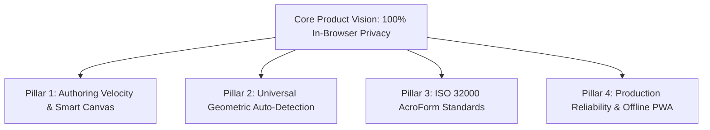
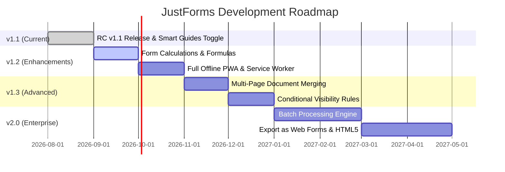

# JustForms Product & Engineering Roadmap

> **Target Timeline**: 2026 – 2027  
> **Repository**: [github.com/sshrestha-design/justforms](https://github.com/sshrestha-design/justforms)  
> **Production App**: [justforms.vercel.app](https://justforms.vercel.app)  
> **Author & Lead Architect**: Sagar Shrestha  

---

## 🎯 Strategic Vision & Core Pillars

JustForms is committed to being the **fastest, cleanest, and most private interactive PDF AcroForm editor** on the web. Everything runs **100% client-side in browser memory** with **zero server telemetry or cloud storage of user documents**.

---

## 🗺️ Release Milestones & Phase Breakdown

---

### 📍 Phase 1: RC v1.1 (Current Production Milestone)

**Objective**: Complete the foundation of precision canvas editing, reliable browser state routing, and enterprise-grade starter documents.

- [x] **Smart Alignment Guides & Distribution Badges**:
  - Horizontal, vertical, and center-canvas pink alignment guides (`#ec4899`).
  - Real-time equal-spacing gap badges (`.spacing-badge`).
  - Snap toggle button and shortcut (`Cmd+;` / `Ctrl+;`) with persistent `localStorage` preference.
- [x] **Universal Geometric Auto-Detection**:
  - Pixel-rendered Lattice table grid detection (`detectTableGridLines`).
  - 4 Affordance heuristics (Checkboxes, Colon prompts, Multi-line question areas, Table line items).
  - Existing AcroForm widget passthrough (`getExistingWidgetFields`).
- [x] **Enterprise Starter Templates**:
  - Standard Commercial Invoice & Billing with itemized table grid and signature.
  - Form W-9 (Taxpayer ID & Certification).
  - Patient Intake & HIPAA Consent form.
  - Residential Rental Lease Application.
- [x] **Navigation & Unsaved Changes Guard**:
  - History state management (`history.pushState` on `#editor`).
  - Back-button interception (`popstate`) with **Leave Form Editor?** confirmation modal (Save `.jform`, Discard, Cancel).
  - `beforeunload` window protection.

---

### 📍 Phase 2: v1.2 — Dynamic Calculations & Offline PWA

**Target Window**: Q3 2026 – Q4 2026  
**Objective**: Introduce calculated fields (invoices/tax formulas) and full offline progressive web application capabilities.

#### 1. Form Calculation Engine (AcroForm JavaScript Actions)
- [ ] **Real-time Calculated Fields**:
  - Field calculation builder in the Properties panel (Sum, Product, Average, Min, Max, Custom JavaScript).
  - Pre-built formulas for invoice grids (`subtotal = sum(item_amount_*)`, `tax_total = subtotal * tax_rate`, `balance_due = subtotal + tax - discount`).
  - Export native Adobe Acrobat JavaScript `/JS` calculation scripts into the PDF AcroForm catalog.

#### 2. Full Offline PWA & Web App Manifest
- [ ] **Service Worker Caching**:
  - Cache core assets (`index.html`, stylesheets, JS modules, Lucide icons, Google Fonts).
  - Cache Mozilla PDF.js and PDF-Lib CDN bundles locally via CacheStorage API.
  - Offline mode badge with instant load times ($< 100\text{ms}$ on repeat visits).

#### 3. Custom Date & Input Masking
- [ ] **Validation Masks**:
  - Phone format `(###) ###-####`.
  - Date format selections (`YYYY-MM-DD`, `MM/DD/YYYY`, `DD/MM/YYYY`).
  - SSN / EIN format `###-##-####` / `##-#######`.
  - Number & Currency formatters with currency symbol prefixes ($ € £ ¥).

---

### 📍 Phase 3: v1.3 — Advanced Logic & Document Assembly

**Target Window**: Q4 2026 – Q1 2027  
**Objective**: Multi-page document management, conditional logic, and custom font uploads.

#### 1. Document Page Management & Merging
- [ ] **Page Operations**:
  - Add blank page / insert template page.
  - Reorder pages via drag-and-drop in the left sidebar thumbnail view.
  - Rotate individual pages ($90^\circ, 180^\circ, 270^\circ$).
  - Merge multiple PDF files directly in-browser before adding form fields.

#### 2. Conditional Field Logic & Dependencies
- [ ] **Interactive Rules**:
  - *If [Checkbox A] is checked $\rightarrow$ show/enable [Field B]*.
  - *If [Dropdown C] equals "Other" $\rightarrow$ require [Text Field D]*.
  - Visual conditional rule builder UI in the Inspector sidebar.

#### 3. Custom Font & Appearance Engine
- [ ] **Typography & Styling**:
  - Custom TrueType (`.ttf`) / OpenType (`.otf`) font file upload for embedded PDF fields.
  - Custom font size auto-scaling (`Auto` font sizing in AcroForm text fields).
  - Rich text formatting option for multi-line notes.

---

### 📍 Phase 4: v2.0 — Enterprise Tooling & Web Form Export

**Target Window**: Q1 2027 – Q2 2027  
**Objective**: High-volume productivity tools, web form conversion, and developer APIs.

#### 1. Fillable HTML5 Web Form Generator
- [ ] **Export to Standalone Web Form**:
  - 1-click conversion from PDF AcroForm to responsive, standalone HTML/CSS web form.
  - Client-side JSON submission handler and downloadable response CSV.

#### 2. Batch Form Population & CSV Mail Merge
- [ ] **Client-Side Bulk Fill**:
  - Upload CSV data file and batch-populate 100+ personalized PDF forms entirely in-browser.
  - Download all populated PDFs as a single `.zip` archive using JSZip.

#### 3. Developer SDK & Web Component
- [ ] **Embeddable JustForms Component**:
  - `<just-forms-editor>` custom element for embedding inside internal React / Vue / Angular portals.
  - Type-safe TypeScript definition package (`@justforms/core`).

---

## 📊 Technical Debt & Performance Targets

| Area | Current Metric | Target Metric | Strategy |
| :--- | :---: | :---: | :--- |
| **Initial Bundle Load** | ~180 KB gzipped | $< 120\text{ms}$ | Tree-shake unused PDF-Lib utilities; preload fonts |
| **Canvas Frame Rate** | 60 FPS | 60 FPS rock-solid | DOM element pooling for alignment guides & bounding boxes |
| **Auto-Detect Latency** | ~450ms (A4 1-page) | $< 250\text{ms}$ | Parallel offscreen canvas workers for lattice detection |
| **Lighthouse Score** | 98 / 100 / 100 / 100 | 100 across all 4 | Web manifest PWA compliance and zero layout shifts |

---

## 🔒 Security & Privacy Commitments

1. **Zero Cloud Ingestion**: User documents NEVER leave the user's browser device.
2. **Zero Analytics on Document Content**: No file names, form values, or field text are ever transmitted to any analytics service.
3. **Open Source Verification**: 100% public source code on GitHub for independent security and privacy audits.
